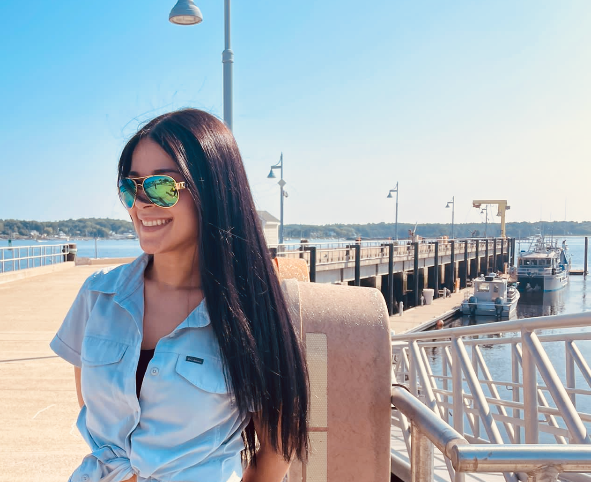

**Hello!**

**My name is Astrid, and I hail from island of Puerto Rico. My educational journey has been a dynamic one, where my passion for science has led me to explore diverse fields.**

**I earned my Bachelor of Science degree in Microbiology from the University of Puerto Rico, where I developed a deep appreciation for the microscopic life. Now, I am in the midst of an exciting adventure as I pursue my Master of Science in Oceanography at the University of New Hampshire.**

**Born and raised in Puerto Rico, my connection to the ocean and its ecosystems runs deep. I'm deeply passionate about assessing public policies that impact our environment and public health. Environmental pollution, particularly in the context of water quality, has been a central focus of my academic journey.**

**I'm equally intrigued by the biochemical interactions that unfold within our oceans, specifically within the realm of microbial oceanography. My current research project in the Ocean Processes Analysis Laboratory delves into the world of microplastics in the water column. I am investigating how these tiny particles impact organic matter formation and its dynamics as it sinks through the ocean's depths.**

> 
