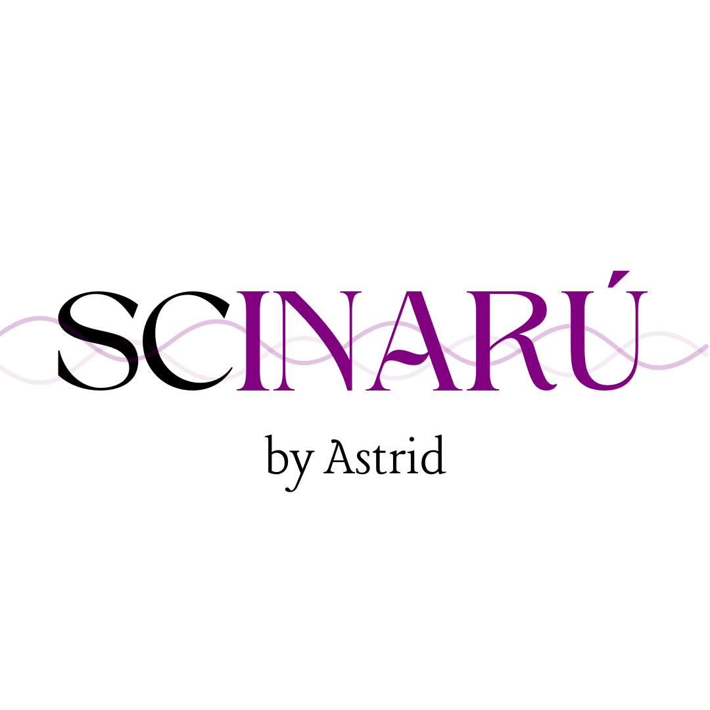

Welcome to SCINARÚ by Astrid!

**This platform name is a meaningful fusion of two words: "sci," representing science in English, and "INARÚ," which translates to "women" in the indigenous Taíno language. This combination symbolizes "Women of Science" and reflects my identity as the founder, a scientist in training.**

**In selecting this name, I pay homage to my ancestral roots, acknowledging the wisdom of the Taíno people who once inhabited the lands I now call home. SCINARU is dedicated to celebrating Latin and Puerto Rican women in the field of science, drawing inspiration from our heritage while looking towards a future where diversity thrives in scientific exploration.**

**The mission is to provide a platform that empowers and represents Latin and Puerto Rican women in science, fostering an inclusive and supportive community. Aiming to share stories, insights, and knowledge that inspire the next generation of scientists and create a space where all voices are heard.**
